# Ecommerce proyect implemented on Spring Framework.
A ecommerce proyect with Spring MVC, Spring Web Flow, Spring Security and Spring Data.

### Landing Page

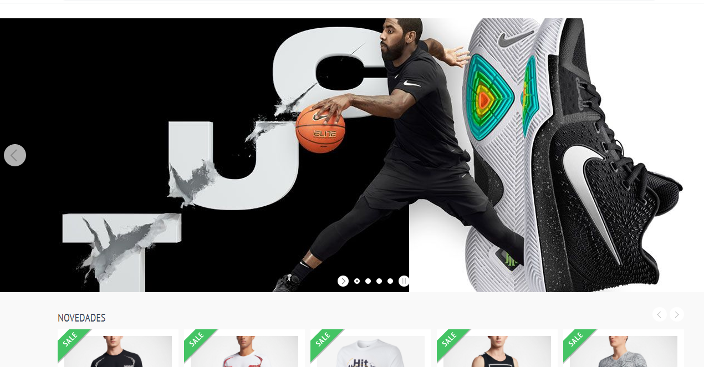

### Login Page

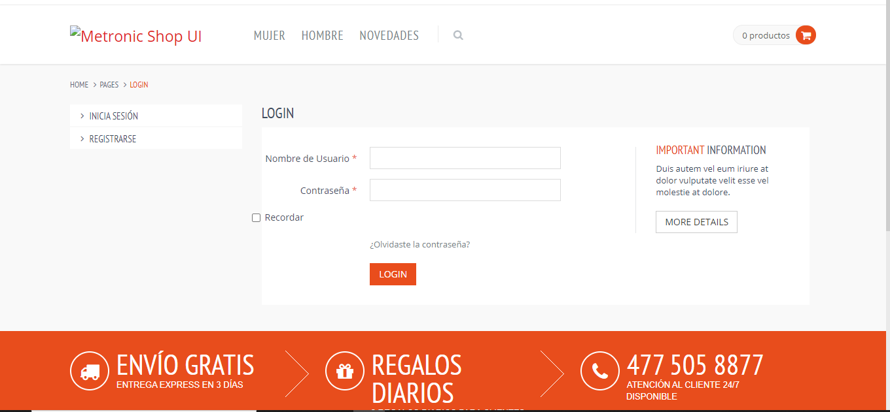

### Users Manadgement (Backoffice)

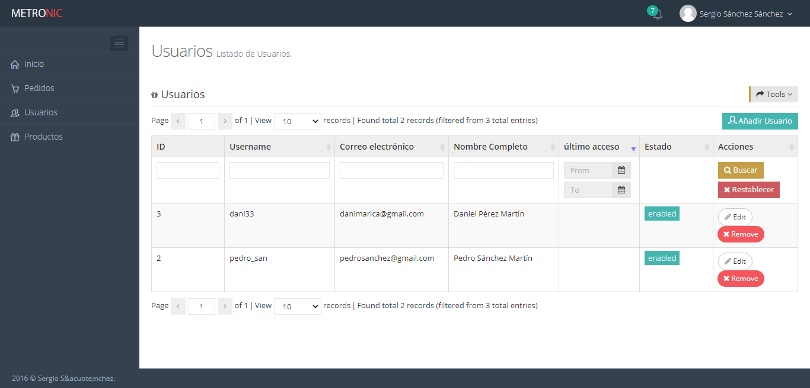

### Update Users (Backoffice)

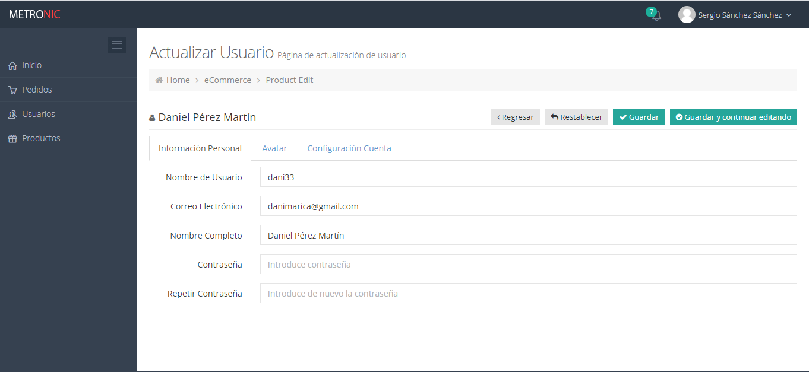

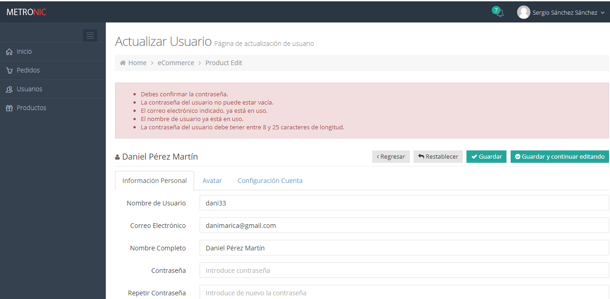

### Product Manadgement (Backoffice)

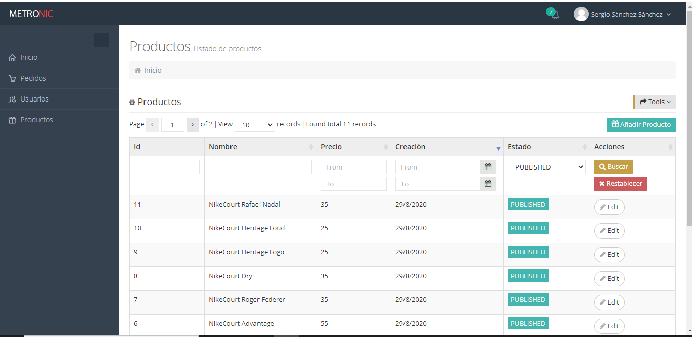

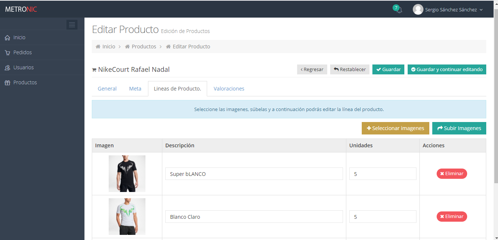

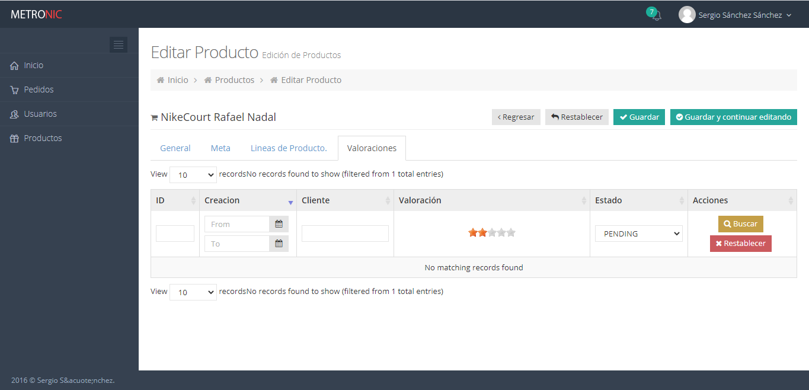

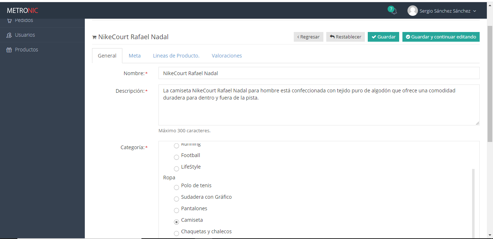

## Product Detail

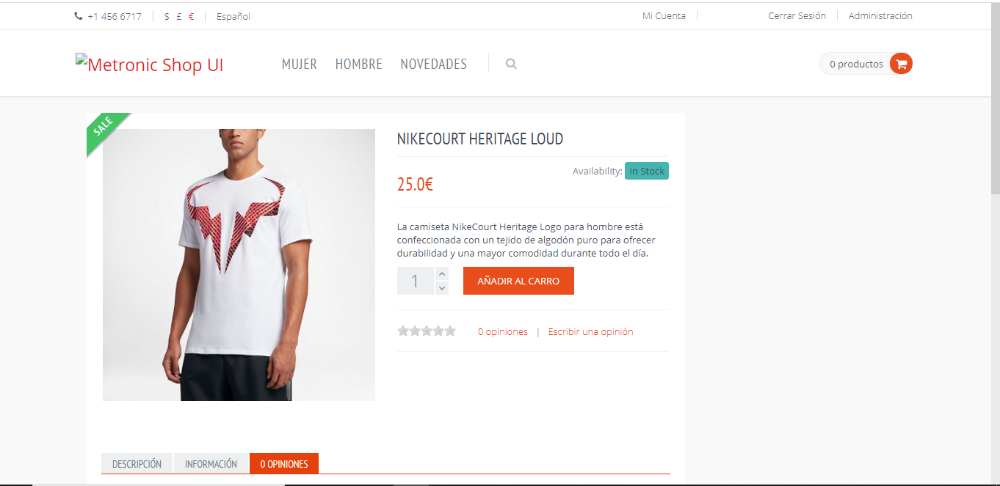

## Buy products

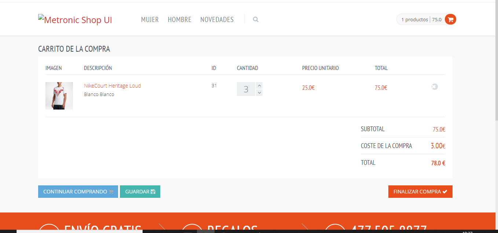

### Dashboard (Backoffice)

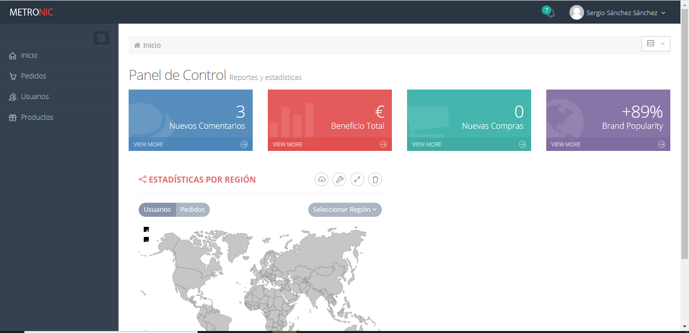
